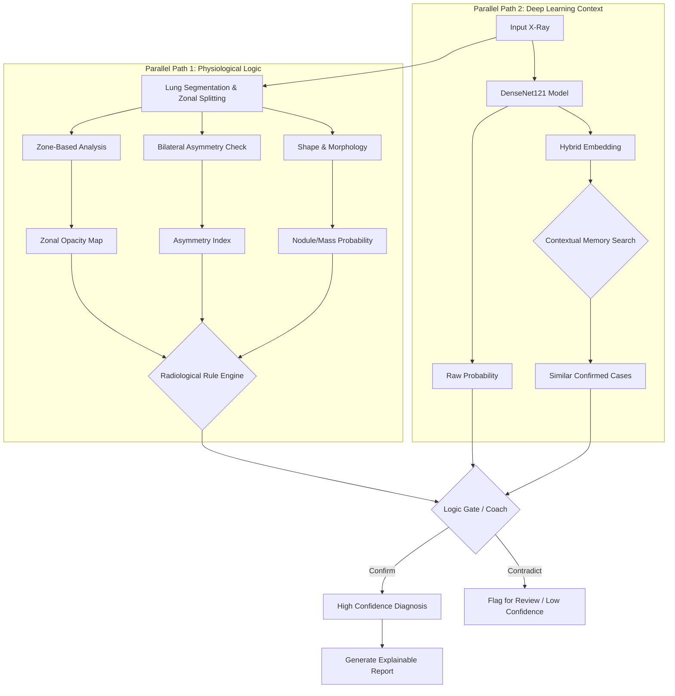

# transparent-xray-pipeline

# Radiology-Inspired Decision Support System

## Conceptual Shift
We are moving away from simple "Computer Vision" (e.g., just edge detection) to a **Clinically-Grounded Decision System**. This system mimics how a radiologist reads an X-ray: by comparing lung zones, checking for asymmetry, and looking for specific morphological signs.

## System Architecture

## 1. Lung-Zone & Segmentation Logic
Instead of treating the X-ray as one flat image, we divide it into **6 Zones** (Upper, Middle, Lower x Left, Right).

| Zone | Primary Targets | Features Computed |
| :--- | :--- | :--- |
| **Upper Zones (Apical)** | Tuberculosis (TB), Pneumothorax | Texture Entropy, Apex Asymmetry |
| **Middle Zones** | Hilar Masses, Vascular Congestion | GLCM Contrast, Vascular Width |
| **Lower Zones (Basal)** | Pneumonia, Effusion, COVID-19 | Intensity Mean, Opacity Distribution |

## 2. Bilateral Asymmetry Metrics
Diseases are rarely perfectly symmetric. We calculate difference metrics between Left and Right lung fields.

*   **Formula**: `Asymmetry = |Left_Feature - Right_Feature| / (Left + Right)`
*   **Logic**:
    *   High Opacity Asymmetry + Lower Zone = **Likely Pneumonia/Effusion**.
    *   High Texture Asymmetry + Upper Zone = **Likely TB**.

## 3. Structural & Morphology Engine
Finding "shapes" is crucial for ruling out false positives from shadows.
*   **Compactness**: Distinguishes round nodules from irregular infiltrates.
*   **Convexity**: Analyzes the smoothness of extensive opacities.
*   **Connected Components**: Measures if opacity is **Focal** (one spot) or **Diffuse** (spread out).

## 4. The "Coach" Fusion Model (Logic Gating)
We do not just average scores. We use **Clinical Rules** to gate the Deep Learning model.

**Example Logic:**
> "The Deep Learning model predicts **Normal (90%)**..."
>
> **BUT**
>
> "The Handcrafted Engine detects **Significant Asymmetry (0.8)** in the Lower Zones."
>
> **RESULT**:
> *   System Downgrades Confidence to **45%**.
> *   Flags: "Discrepancy Detected: AI sees Normal, but structural asymmetry is high. Review Recommended."

## 5. Dual-Database Strategy
We store the **Full Context** of a diagnosis, not just the image embedding.
*   **Stored Record**: `[DenseNet_Vector (1024) + Handcrafted_Vector (Lung_Zones, Asymmetry)]`
*   **Retrieval**: "Find traces that looked like this *AND* had similar asymmetry patterns."

## 6. Clinical Hardening & Safety Layer (Phase-1 MVP)
We implement strict "Gatekeepers" to prevent garbage-in-garbage-out.

| Component | Function | Failure Action |
| :--- | :--- | :--- |
| **Anatomy Validator** | Checks Lung Area Ratio (15-60%) & Mediastinum Integrity | **WARN & DOWNGRADE** (Conf <= 0.4) |
| **View Classifier** | Detects AP (Portable) vs PA (Standard) view | **ADJUST THRESHOLDS** (Relax CTR for AP) |
| **Disagreement Engine** | Compares Deep Learning vs Handcrafted findings | **ADD CLINICAL NOTE** (Flag contradiction) |

### The "Radiology Reasoner" (Soft Logic)
We replace binary thresholds with **Confidence Penalties**:
> `Final_Confidence = Raw_DL_Score * (1 - Asymmetry_Penalty) * (1 - Quality_Penalty)`

*Example*:
*   Raw DL Score: **0.95** (Pneumonia)
*   Image Quality: **Low** (Penalty 0.2)
*   **Final Score**: 0.95 * 0.8 = **0.76** (Moderate Confidence)

### Asymmetric Disagreement
*   **Scenario A**: DenseNet says Mass (0.9) BUT Texture is Normal → **Flag "Possible False Positive"**.
*   **Scenario B**: DenseNet says Normal (0.2) BUT High Asymmetry → **Flag "Possible Early Disease"**.

